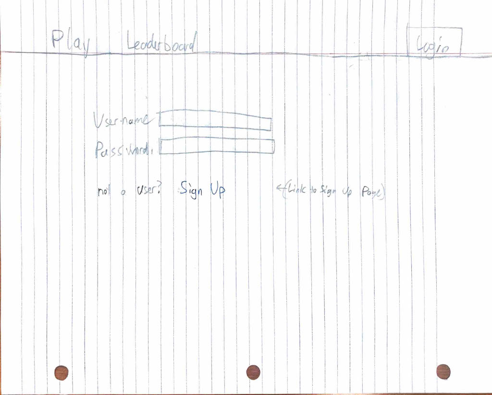
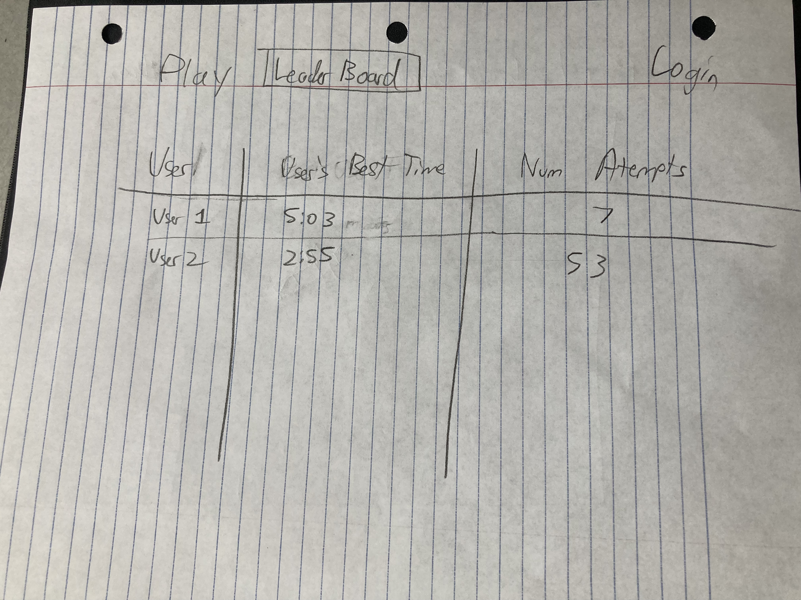
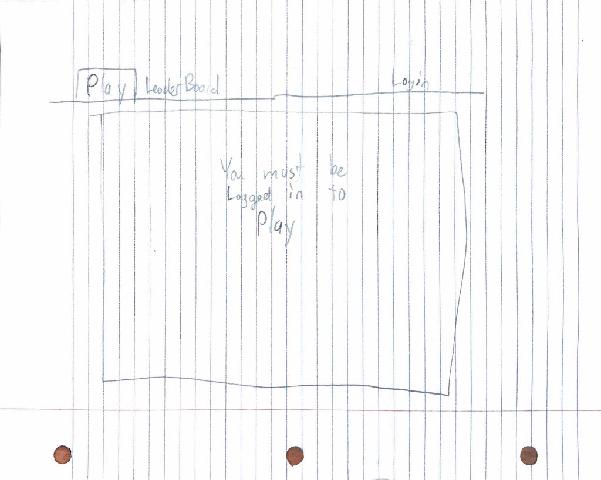
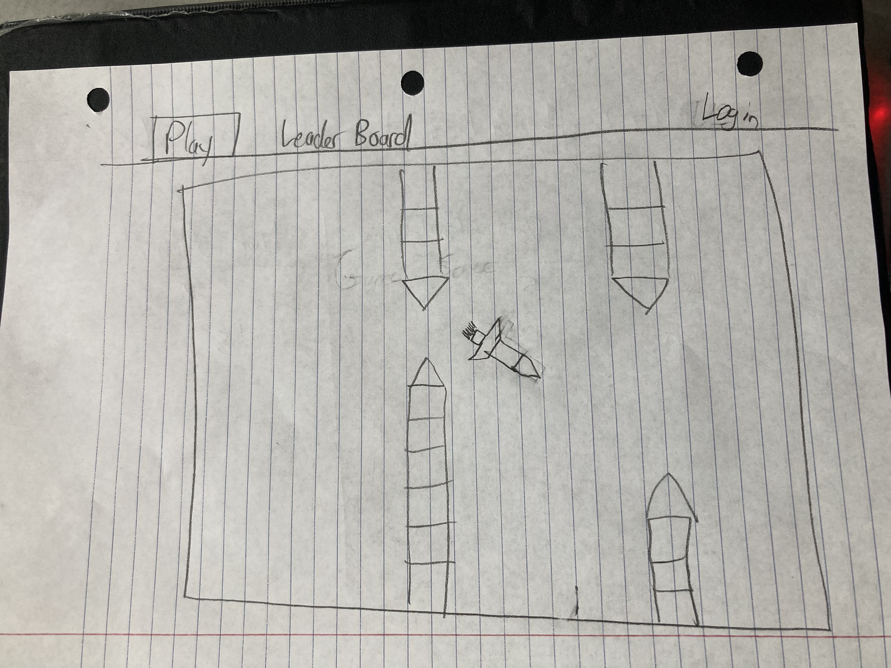

# Elevator Pitch
## Idea
I want to make a simple web game. 
It will be a 2d infinite tap scroller. It will be based on Geometry Dash and specifically it's spaceship play. 
It can also be compared to flappy birds. 
The player will have to press (and hold) the screen in order to make the spaceship go up. 
If they let go, the spaceship will fall down.
There will be infinite obstacles that are randomly generated that the user will have to navigate around. 
If they touch them, they will die.

## Key Features
##### Player Controls:
The player will have the ability to press or not press. When they are pressing, the spaceship will go up. If not, the spaceship will go down.
##### Infinite game:
The game will just be a game like flappy birds, and the obstacles the user will face will be randomly generated
##### Game Score
The game will have a timer and an attempt counter. As the player 
##### Global Leaderboard
The website will have a global leaderboard that will show every player who has played the game. 
Attached to each player on the leaderboard will be the number of Attempts, and their best attempt (By distance or time)

## Technologies
##### HTML:
The website will have a few tabs that the user can navigate to, including a login tab, a leaderboard tab, and a play tab. 
##### CSS: 
The graphics of the game will be done pretty much entirely in CSS. The website's fanciness will also be done in CSS
##### Javascript: 
The game's functionality, including player interaction, the movement of the screen, and the randomness will all be done in Javascript
##### Web service:
The web server will host the user database and the leaderboard.
The users will communicate with the web service to get login, open the leaderboard, and establish web socket connections.
##### Authentication:
The user will have to sign up / login before they will be able to play a game. The Server will then start tracking the player statistics
##### Database data:
This database will include all the users credentials and information about past play through (For the leaderboard)
##### WebSocket data:
The Websocket connection will send data from the server's leaderboard to each logged in user. 
That way, the user can access updated leaderboard information whenever they want. 
So when a player gets a personal high score, they will be able to see it immediately
##### Web framework / React:
React will help improve the game/website's functionality and use-ability.
React will also help reduce the size of the website

## Sketches

