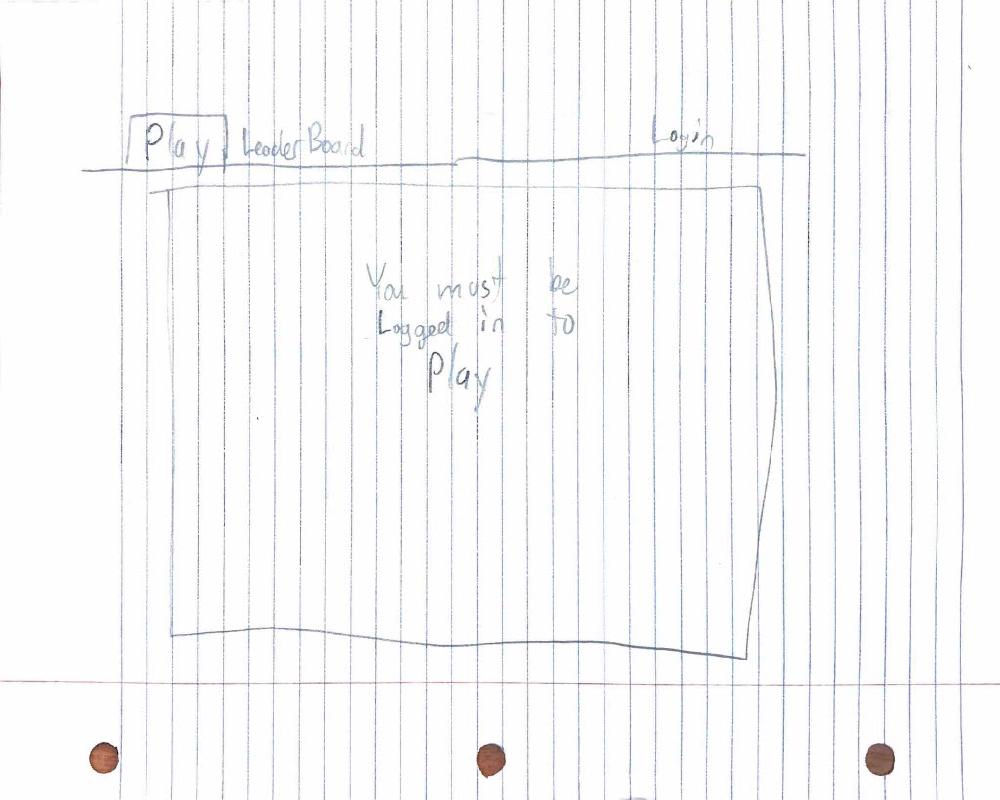
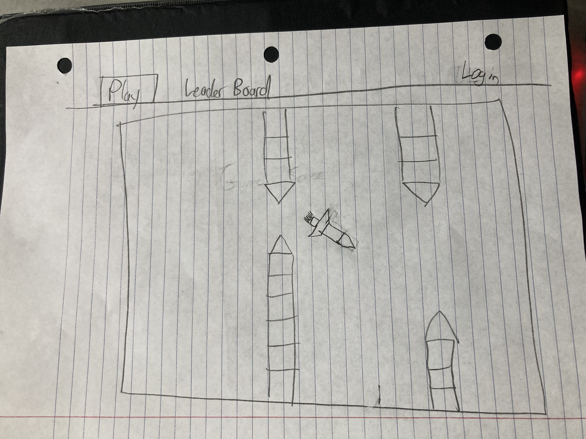

# Elevator Pitch
## Idea
I want to make a simple web game. 
It will be a 2d infinite tap scroller. It will be based on Geometry Dash and specifically it's spaceship play. 
It can also be compared to flappy birds. 
The player will have to press (and hold) the screen in order to make the spaceship go up. 
If they let go, the spaceship will fall down.
There will be infinite obstacles that are randomly generated that the user will have to navigate around. 
If they touch them, they will die.

## Key Features
##### Player Controls:
The player will have the ability to press or not press. When they are pressing, the spaceship will go up. If not, the spaceship will go down.
##### Infinite game:
The game will just be a game like flappy birds, and the obstacles the user will face will be randomly generated
##### Game Score
The game will have a timer and an attempt counter. 
As the player plays an attempt, the timer will count up for time survived. 
The number of play attempts will also be recorded.
##### Global Leaderboard
The website will have a global leaderboard that will show every player who has played the game. 
Attached to each player on the leaderboard will be the number of Attempts, and their best attempt (By distance or time)

## Technologies
##### HTML:
The website will have a few tabs that the user can navigate to, including a login tab, a leaderboard tab, and a play tab. 
##### CSS: 
The graphics of the game will be done pretty much entirely in CSS. The website's fanciness will also be done in CSS
##### Javascript: 
The game's functionality, including player interaction, the movement of the screen, and the randomness will all be done in Javascript
##### Web service:
The web server will host the user database and the leaderboard.
The users will communicate with the web service to get login, open the leaderboard, and establish web socket connections.
##### Authentication:
The user will have to sign up / login before they will be able to play a game. The Server will then start tracking the player statistics
##### Database data:
This database will include all the users credentials and information about past play through (For the leaderboard)
##### WebSocket data:
The Websocket connection will send data from the server's leaderboard to each logged in user. 
That way, the user can access updated leaderboard information whenever they want. 
So when a player gets a personal high score, they will be able to see it immediately
##### Web framework / React:
React will help improve the game/website's functionality and use-ability.
React will also help reduce the size of the website

## Sketches

# Project Deliverables
## HTML Deliverable
I built out the structure of the website by doing:
* I built three web pages for each aspect of the game, with hyperlinks between all the pages.
* I added my github repository link at the bottom of each of the 3 pages.
* On every page, I added a Title with the function of that page
* On every page, I organized the content of the page with Header, Main, and Footer HTML elements
* The login page, or index.html, is where the user will login. I added a username and password box. The user will need to login before they can play.
* I also will display the user's username when they are logged in, in index.html (really login.html)
* I built a leaderboard that will be updated with user data from the database. It will show each user's username, longest time, and number of attempts.
* At the bottom of the leaderboard page I added a time and date, that will display the last time the leaderboard has been updated. This will be updated through websockets, everytime data is sent by a websocket connection.
* On play.html I made a div element that will contain the future game. I also uploaded a temporary image to show kinda what the game will be like. 

## CSS Deliverable
I decorated and finalized the structure of the website in CSS by doing:
* I divided each html page by header, main, and footer, by using css to define a clear size, background, and border for each section
* I chose a special font and outline for all text on the webpage, giving a pixel / robotic appearance
* I made a changing background for every webpage (using a little javascript), that cycles through the rainbow to give a Geometry Dash vibe
* I made every division/element center in its space, and resize if possible, when the dimensions of the webpage are changed
* I made the nav/header hyperlinks color based on which page you are on
* I centered the gitHub link in the footer in the center of the page 
* For the login page, I centered everything, so it looks like a proper login page
* For the leaderboard page, I divided up the space between the leaderboard and the websocket text at the bottom
* For the Table in the Leaderboard, I divided up and edited the table to make it easier to read
* For the play page, I added an outline which signifies the play box, and I added an image which represents how I will modify position and rotation of images using javascript to make the game functional

## JS Deliverable
I added functionality to all the HTML and CSS by doing:
* I fully implemented the background script to save the color between pages
* I added sign up page similar to the login page
* I added functionality to the signup and login buttons, so that they display the logged in user in the upper left corner, and it saves across pages
* On the leaderboard page, I added future support for database data by creating a table that will dynamically fill with data provided to it, 
  * I added websocket support by making it so that you can see the EXACT time the leaderboard updates and gets new data.
* I coded most of the logic for the game, including:
  * The player ship rotating according to space bar
  * The player ship and blocks moving across the page
  * The automatic creation of objects, so I can use javascript to add, move, and delete objects, for game creation, gameplay, and the end-screen.
  * The hiding and future deletion of objects when they exit the play-box
  * The detection of collisions, so that I can end the game in the future